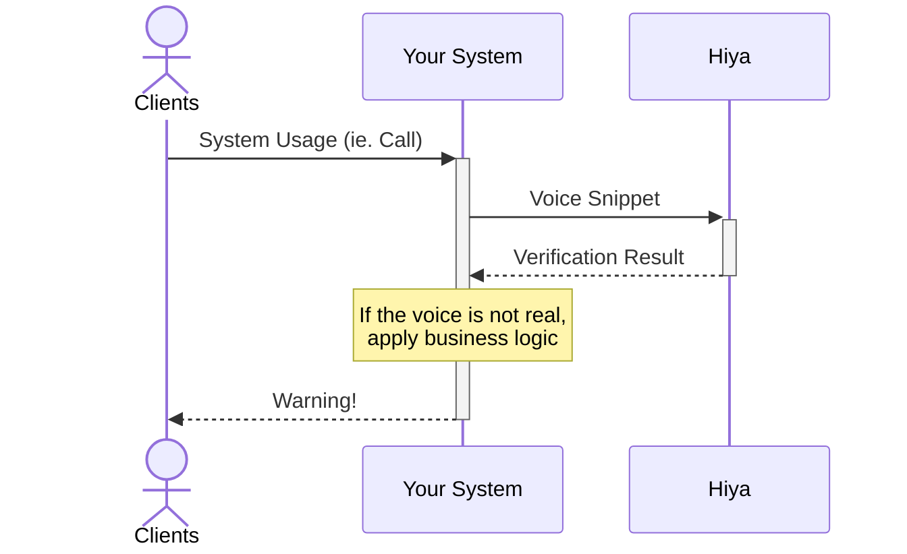

In this page we explain how you can integrate your existing application with 
the Hiya voice verification service, in order to detect synthetic voices or replays.

This kind of findings can empower your system or application to avoid 
fraud to your employees and clients.

<Note>This is just a sample, meant to cover the most basic use case. 
You can tailor the use of our API to your exact needs! </Note>

<Tip>Check the [Authenticity Best Practices page][5] for recommendations!</Tip>

# Architecture
You can use Hiya API to verify voice as soon as is processed by your system. 
We provide insightful results near real time, so you can apply necessary actions promptly, 
like warning users, system administrators or ending the call.
## Diagram

## Integration Steps
In order to use this functionality, you need to perform this three steps:
<Steps>
  <Step title="Record the voice">
    You need to have a record of the audio that you want to verify. 
    <Note>We can process recordings of different quality and formats, please check the [media file requirements][1].</Note>
  </Step>
  <Step title="Send the voice for verification">
    You can send the voice for verification using our API. 
    Please check the [guide for performing an authenticity verification][2].

    We will return the [verification scores and subscores][3], which provide insights of whether the voice is synthetic, replayed, etc.
  </Step>
  <Step title="Use the insights">
    Once you have all the relevant data, you can decide which actions to take based on your business logic.
    Please check the [verification thresholds page][4] for reference and recommendations on interpreting the results.
    This are some common immediate actions to take, if the voice is deemed not real:
    - Warn the end user of the suspected fraud, so that they can decide on how to proceed.
    - Alert the security team of the incident, for in depth analysis and Cyber Thread Intelligence.
    - Directly end the call or communication, in order to protect the end user.
  </Step>
</Steps>

[1]: /api-reference/voice-samples/requirements
[2]: /guides/perform-a-verification/authenticity
[3]: /api-reference/verifications/scores
[4]: /api-reference/verifications/thresholds
[5]: /use-cases/authenticity/authenticity-best-practices
