In this page we explain how you can integrate your Call Center Systems with
the Hiya voice verification service, in order to detect fraud, protect your client's
data and improve operational efficiency.

<Note>
  This is just a sample, meant to cover the general call center use case. You
  can tailor the use of our API to your exact needs!{" "}
</Note>

<Tip>Check the [Authenticity Best Practices page][5] for recommendations!</Tip>

# Architecture

You can use Hiya API to empower your call center productivity and security.
By promptly detecting synthetic voices, you can prevent fraud, protect your clients
and save valuable employee time.  
We provide insightful results near real time, so you can integrate the voice verification in
your existing call flow, taking immediate actions if necessary, like warning the agents or ending the call.

## Sample Call Flow Diagram

## Integration Steps

In order to use this functionality, you need to perform this three steps:

<Steps>
  <Step title="Record the voice">
    You need to have a record of the client call. This is usually accomplished
    via some voice protocol like SIPRec, and is also often required for legal
    compliance.
    <Note>
      We can process recordings of different quality and formats, please check
      the [media file requirements][1].
    </Note>
  </Step>
  <Step title="Send the voice for verification">
    You can send the voice for verification using our API. Please check the
    [guide for performing an authenticity verification][2]. We will return the
    [verification scores and subscores][3], which provide insights of whether
    the voice is synthetic, replayed, etc.
    <Tip>
      Since [only few voice seconds are needed][6] for accurate results, you can
      reuse the existing IVR input you use for routing as verification.
    </Tip>
  </Step>
  <Step title="Use the insights">
    Once you have all the relevant data, you can decide which actions to take
    based on your business logic. Please check the [verification thresholds
    page][4] for reference and recommendations on interpreting the results. This
    are some common immediate actions to take, if the voice is deemed not real:
    - Warn the call center agent of the suspected fraud, so that they can decide
    on how to proceed. - Alert the security team of the incident, for in depth
    analysis and Cyber Thread Intelligence. - Directly end the call.
  </Step>
</Steps>

# Administration

The Hiya Console provides a graphical interface that allows your team to
effectively manage the Hiya Audio Intelligence APIs Service. API endpoints are also available for
administration and platform monitoring

```mermaid
flowchart LR
    A[🕵️ Security Team] <-->|Cyber Thread Intelligence| C(💻 Hiya Console)
    B[💼 Managers] <-->|Reporting| C
    E[👨‍💻 System Administrators] -->|Manage| C
    C <--> D(⚙️ Hiya API)
```

<Tip>Check [usage statistics][7] and [usage records][8] for more details.</Tip>

<Card title="Security Team" icon="shield-halved">
  Mitigate AI fraud risk, and gather more Thread Intelligence based on evolving
  TTPs of top actors. Monitor the fraudulent calls, identify key security
  improvement points and raise awareness of new types of cyber attacks.
</Card>
<Card title="Managers" icon="briefcase">
  Monitor fraud KPIs and leverage voice insights for internal and external
  reporting.
</Card>
<Card title="System Administrators" icon="computer">
  Easily configure and manage the Hiya Audio Intelligence APIs usage, including
  IAM and retention policies.
</Card>

[1]: /api-reference/voice-samples/requirements
[2]: /guides/perform-a-verification/authenticity
[3]: /api-reference/verifications/scores
[4]: /api-reference/verifications/thresholds
[5]: /use-cases/authenticity/authenticity-best-practices
[6]: /api-reference/voice-samples/requirements#voice-activity
[7]: /api-reference/usage-statistics/overview
[8]: /api-reference/usage-records/overview
