In this page we explain how you can integrate your Caller ID System with
the Hiya voice verification service, in order to protect your clients
from bot calls, identity fraud and advanced scam techniques.

<Note>
  This is just a sample, meant to cover the general Caller ID use case. You can
  tailor the use of our API to your exact needs!
</Note>

<Tip>Check the [Authenticity Best Practices page][5] for recommendations!</Tip>

# Architecture

You can use Hiya API to empower your Caller ID System security.
By promptly detecting synthetic voices, you can prevent fraud and
protect your clients against advanced actors.
We provide insightful results near real time, so you can integrate the voice verification in
your existing call flow, taking immediate actions if necessary, like warning the attacked client
and protecting other clients from the same actor.

You can integrate the voice verification service in different ways, depending on your needs:

<CardGroup cols={2}>
  <Card
    title="On Demand Analysis"
    icon="lock"
    href="/use-cases/authenticity/caller-id-authenticity-use-case#sample-on-demand-analysis-diagram"
  >
    Allow your users to manually select when a calls authenticity needs to be
    verified.
  </Card>
  <Card
    title="Automated Analysis"
    icon="repeat"
    href="/use-cases/authenticity/caller-id-authenticity-use-case#sample-automated-analysis-diagram"
  >
    Automatically Analyze unknown callers and potential thread actors.
  </Card>
</CardGroup>

## Sample On Demand Analysis Diagram

## Sample Automated Analysis Diagram

## Integration Steps

In order to use this functionality, you need to perform this four steps:

<Steps>
  <Step title="Record the voice">
    You need to have the record of the client call.
    <Note>
      We can process recordings of different quality and formats, please check
      the [media file requirements][1].
    </Note>
  </Step>
  <Step title="Send the voice for verification">
    You can send the voice for verification using our API. Please check the
    [guide for performing an authenticity verification][2]. We will return the
    [verification scores and subscores][3], which provide insights of whether
    the voice is synthetic, replayed, etc.
  </Step>
  <Step title="Properly Inform the User">
    Once you have all the relevant data, you can decide which actions to take
    based on your business logic. For instance, you could warn the user via a
    sound or GUI.
    <Note>
      Check the [verification thresholds page][4] for reference and
      recommendations on interpreting the results.
    </Note>
  </Step>
  <Step title="Build the caller ID profile">
    You can use the verification data for building the caller ID profile and
    preventing future fraud.
    <Tip>
      Refer to the [List Chunks Endpoint][7] for detailed information about the
      moments when the audio is real or not.
    </Tip>
  </Step>
</Steps>

# Administration

The Hiya Console provides a graphical interface that allows your team to
effectively manage the Hiya Audio Intelligence APIs Service. API endpoints are also available for
administration and platform monitoring

```mermaid
flowchart LR
    A[🕵️ Security Team] <-->|Cyber Thread Intelligence| C(💻 Hiya Console)
    B[💼 Managers] <-->|Reporting| C
    E[👨‍💻 System Administrators] -->|Manage| C
    C <--> D(⚙️ Hiya API)
```

<Tip>Check [usage statistics][8] and [usage records][9] for more details.</Tip>

<Card title="Security Team" icon="shield-halved">
  Mitigate AI fraud risk, and gather more Thread Intelligence based on evolving
  TTPs of top actors. Monitor the fraudulent calls, identify key security
  improvement points and raise awareness of new types of cyber attacks.
</Card>
<Card title="Managers" icon="briefcase">
  Monitor fraud KPIs and leverage voice insights for internal and external
  reporting.
</Card>
<Card title="System Administrators" icon="computer">
  Easily configure and manage the Hiya Audio Intelligence APIs usage, including IAM and
  retention policies.
</Card>

[1]: /api-reference/voice-samples/requirements
[2]: /guides/perform-a-verification/authenticity
[3]: /api-reference/verifications/scores
[4]: /api-reference/verifications/thresholds
[5]: /use-cases/authenticity/authenticity-best-practices
[6]: /api-reference/voice-samples/requirements#voice-activity
[7]: /api-reference/authenticity-verifications/list-chunks
[8]: /api-reference/usage-statistics/overview
[9]: /api-reference/usage-records/overview
