In this page we explain how you can integrate your existing application with 
the Hiya voice identity service, in order to securely authenticate users with their voice.

<Tip>This is just a sample, meant to cover the most basic use case. 
You can tailor the use of our API to your exact needs! </Tip>

# Architecture
For the identity use case, we have two different flows that need to be integrated, the [Enrollment Process][5] and the [Authentication Process][6].
## Enrollment Process
This is the first flow for users, during which their [voiceprint][7] is generated for authenticating them later.

During this process, we need to gather audio from the user, and verify it, in order to compute a secure [voiceprint][7].
### Sample Enrollment Diagram

### Enrollment Integration Steps
In order to start enrolling the users, you need to perform this three steps:
<Steps>
  <Step title="Record the voice">
    You need to have a record of the audio that you want to use for creating the user [voiceprint][7]. 
    They can be of different quality and formats, please check the [media file requirements][1].
    <Tip>Check the [Identity Best Practices Page][8] for recommendations.</Tip>
  </Step>
  <Step title="Upload the audios and verify them">
    You can send the audios for verification using our API. Later you can perform [message verification][10] and [authenticity verifications][11] against them.
    Please check the [guide for performing an authenticity verification][2] and [guide for performing a message verification][13].

    We will return the [verification scores and subscores][3], which provide insights of whether the voice spoke the specified message, is synthetic, replayed, etc.
    <Warning>Not verifying the audios used for the voiceprint creation could pose security risks</Warning>
  </Step>
  <Step title="Compute the voiceprint">
    Once the audios are verified, you can compute the [voiceprint][7].
    Please check the [guide for computing a voiceprint][13].
  </Step>
</Steps>

## Authentication Process
After the user voiceprint is created, later audios can be verified against it, in order to verify that
it's the same person speaking.

This capability allows for biometric MFA implementation in different scenarios.
### Sample Authentication Diagram

### Authentication Integration Steps
In order to use this functionality, you need to perform this three steps:
<Steps>
  <Step title="Record the voice">
    You need to have a record of the audio that you want to verify. 
    They can be of different quality and formats, please check the [media file requirements][1].
  </Step>
  <Step title="Upload the audio and verify them">
    You can send the audio for verification using our API. Later you can perform [message verification][10] and [identity verifications][15] against them.
    Please check the [guide for performing an authenticity verification][2] and the [guide for performing an identity verification][14].
    We will return the [verification scores and subscores][3], which provide insights of whether the voice matches against the identity, or synthetic, replayed, etc.
  </Step>
  <Step title="Use the insights">
    Once you have all the relevant data, you can decide which actions to take based on your business logic.
    Please check the [verification thresholds page][4] for reference and recommendations on interpreting the results.
    This are some common immediate actions to take:
    - If the voice **is not real**, warn the customer of the suspected fraud and don't authorize the operation.
    - If the voice **doesn't match against the customer identity**, warn the customer of the suspected fraud and don't authorize the operation.
    - If the voice **is real and matches against the customer identity**, authorize the operation.
  </Step>
</Steps>

# Administration
The Hiya Console provides a graphical interface that allows your team to 
effectively manage the Hiya Audio Intelligence APIs Service. API endpoints are also available for 
administration and platform monitoring 

```mermaid
flowchart LR
    A[🕵️ Security Team] <-->|Cyber Thread Intelligence| C(💻 Hiya Console)
    B[💼 Managers] <-->|Reporting| C
    E[👨‍💻 System Administrators] -->|Manage| C 
    C <--> D(⚙️ Hiya API)
```

<Tip>Check [usage statistics][16] and [usage records][17] for more details.</Tip>

<Card title="Security Team" icon="shield-halved">
Mitigate AI fraud risk, and gather more Thread Intelligence based on evolving TTPs of top actors.
Monitor the fraudulent calls, identify key security improvement points and raise awareness of new types of 
cyber attacks.
</Card>
<Card title="Managers" icon="briefcase">
Monitor fraud KPIs and leverage voice insights for internal and external reporting.
</Card>
<Card title="System Administrators" icon="computer">
Easily configure and manage the Hiya Audio Intelligence APIs usage, including IAM and retention policies.
</Card>

[1]: /api-reference/voice-samples/requirements
[2]: /guides/perform-a-verification/authenticity
[3]: /api-reference/verifications/scores
[4]: /api-reference/verifications/thresholds
[5]: /use-cases/identity/basic-identity-use-case#enrollment-process
[6]: /use-cases/identity/basic-identity-use-case#authentication-process
[7]: /api-reference/voiceprints/overview
[8]: /use-cases/identity/identity-best-practices
[9]: /guides/create-an-identity
[10]: /api-reference/message-verifications/overview
[11]: /api-reference/authenticity-verifications/overview
[12]: /guides/compute-a-voiceprint
[13]: /guides/perform-a-verification/message
[14]: /guides/perform-a-verification/identity
[15]: /api-reference/identity-verifications/overview
[16]: /api-reference/usage-statistics/overview
[17]: /api-reference/usage-records/overview
